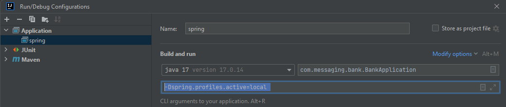

# kataMessage, Monolith app, MQ-IBM

To avoid the complexities of manual installation and configuration,
we can run IBM MQ inside a Docker container.

Option 1:
run docker compose file on the project structure

Option 2:
you can do it manually.
You can use the following command to run the container with a basic configuration
(dev mode will have access to dev channel):

1- docker run --name my-mq --env LICENSE=accept --env MQ_QMGR_NAME=QM1 \
--publish 1414:1414 \
--publish 9443:9443 \
--detach \
ibmcom/mq

2- docker exec -it my-mq bash.

3- runmqsc QM1

4- DEFINE QLOCAL(QUEUE1)

5- SET AUTHREC OBJTYPE(QUEUE) PROFILE('QUEUE1') PRINCIPAL('app') AUTHADD(ALL)

6- END 

7- exit

Be careful, this is an old docker image from docker-hub. If you want a new 
image, should run:

1- docker run -d  --name my-mq  --privileged  -e LICENSE=accept -e MQ_DEV=TRUE -e MQ_QMGR_NAME=QM1 
-p 1414:1414  -p 9443:9443  icr.io/ibm-messaging/mq:latest

2- docker exec -it my-mq bash

3 runmqsc QM1

4- display channel(*) -> to verify if the dev mode is active, if not, you need
to create a channel and grant privilege.

To Test, please run:
1- clone and run the project locally

1- curl -X POST -H "Content-Type: text/plain" -d "Hello MQ3" http://localhost:8080/api/v2/messages/create

2- curl http://localhost:8080/api/v2/messages/last-received

To realize this kata, I got throught this resources:

1- https://github.com/ibm-messaging/mq-jms-spring

2- https://www.baeldung.com/java-message-service-ibm-mq-read-write

3- https://github.com/ibm-messaging/mq-dev-patterns/blob/master/Spring-JMS/src/main/java/com/ibm/mq/samples/jms/spring/level102/MessageConsumer102.java

4-https://www.baeldung.com/spring-retry