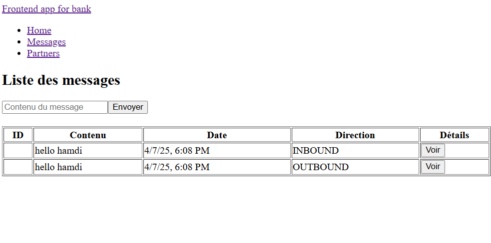
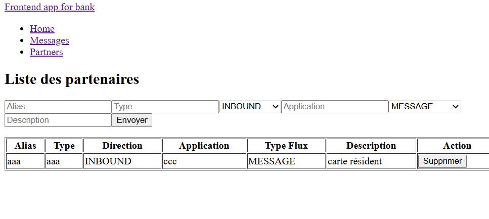

IBM MQ Integration with Monolith App – KataMessage
To avoid the manual complexity of setting up IBM MQ, we leverage Docker to spin up the MQ broker easily. Below are two ways to run IBM MQ.

🚀 Option 1: Docker Compose
Run the docker-compose.yml file located in the project root. (the file is already configured)

⚙️ Option 2: Manual Docker Setup for exploring the journey
🔹 Option A: Using the legacy Docker Hub image
bash
Copier
Modifier
docker run --name my-mq \
--env LICENSE=accept \
--env MQ_QMGR_NAME=QM1 \
--publish 1414:1414 \
--publish 9443:9443 \
--detach \
ibmcom/mq

docker exec -it my-mq bash
Inside the container:

bash
Copier
Modifier
runmqsc QM1
DEFINE QLOCAL(QUEUE1)
SET AUTHREC OBJTYPE(QUEUE) PROFILE('QUEUE1') PRINCIPAL('app') AUTHADD(ALL)
END
exit
⚠️ Note: ibmcom/mq is an older image. For newer environments, prefer the IBM Container Registry version.

🔹 Option B: Using the latest IBM MQ image
bash
Copier
Modifier
docker run -d \
--name my-mq \
--privileged \
-e LICENSE=accept \
-e MQ_DEV=TRUE \
-e MQ_QMGR_NAME=QM1 \
-p 1414:1414 \
-p 9443:9443 \
icr.io/ibm-messaging/mq:latest

docker exec -it my-mq bash
Inside the container:

bash
Copier
Modifier
runmqsc QM1
display channel(*)

# If dev channel not visible, manually create a channel and set appropriate permissions.
✅ Testing
Start the application:
Clone and run the project locally.

Use curl to test message operations:
bash
Copier
Modifier
# Push a message (V2 - JMSListener)
curl -X POST -H "Content-Type: text/plain" \
-d "Hello MQ3" \
http://localhost:8080/api/v2/messages/create

# Retrieve the last message
curl http://localhost:8080/api/v2/messages/last-received
🛠 Development Notes
Initially implemented manual push/pull logic (v1)

Later refactored the code using JMSListener for better integration (v2)

# Run the front app
ng serve so you can use the front (another alternative for curls)

example of data send to the queue and get back from the db.

partner screen

📚 Resources Used
IBM MQ Spring JMS sample
🔗 https://github.com/ibm-messaging/mq-jms-spring

Baeldung IBM MQ integration
🔗 https://www.baeldung.com/java-message-service-ibm-mq-read-write

IBM MQ dev patterns (JMS consumer example)
🔗 https://github.com/ibm-messaging/mq-dev-patterns/blob/master/Spring-JMS/src/main/java/com/ibm/mq/samples/jms/spring/level102/MessageConsumer102.java

Spring Retry guide
🔗 https://www.baeldung.com/spring-retry

